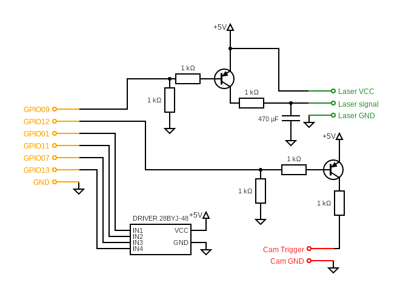

# Stereo Active Package

This package provides functionalities for stereo image acquisition, noise image generation, and inverse triangulation using ROS 2. It includes nodes for capturing synchronized stereo images, displaying noise images, and performing inverse triangulation to generate 3D point clouds.

## Features

- **Stereo Image Acquisition**: Captures synchronized stereo images and saves them to a specified directory.
- **Noise Image Generation**: Generates and displays noise images on a specified monitor, ideal for pattern projection applications.
- **Inverse Triangulation**: Processes stereo images to generate 3D point clouds using inverse triangulation techniques.

## Dependencies

- ROS 2
- OpenCV
- CUDA
- libnoise

### Version Requirements
- **ROS 2**: Humble
- **OpenCV**: 4.5.4
- **CUDA**: Version 12.6
- **JetPack**: 6.2 [L4T 36.4.3]

## Installation

### 1. Clone the Repository:
   First, navigate to your ROS 2 workspace and clone the package:
   ```sh
   cd ~/ros2_ws/src
   git clone https://github.com/yourusername/stereo_active.git
   cd stereo_active
   ```

### 2. Install `libnoise`:
   Follow these commands to install `libnoise`, which is required for generating noise patterns.
   ```sh
   cd
   git clone https://github.com/qknight/libnoise.git
   cd libnoise
   mkdir build
   cd build
   cmake ..
   make
   sudo make install
   sudo ldconfig
   ```

### 3. Build the Package:
   After setting up dependencies, build the package using `colcon`:
   ```sh
   cd ~/ros2_ws && colcon build
   ```

## Usage

### Launching Nodes

1. **Jetson GPIO Control Node**:
   This node controls the motor, trigger signals, and laser projection via GPIO pins on the Jetson Orin Nano.
   ```sh
   ros2 launch stereo_active gpiod_control.launch.py
   ```

2. **Noise Image Generation Node**:
   This node generates random noise patterns to project onto a surface. You can use this for calibration or pattern projection with multimedia projectors.
   ```sh
   ros2 launch stereo_active noise_display.launch.py
   ```

3. **Inverse Triangulation Node**:
   This node acquires and processes stereo images to generate 3D point clouds. It triggers the laser projection and manages image acquisition.
   ```sh
   ros2 launch stereo_active inverse_triangulation.launch.py
   ```

### Electrical Diagram

The NVIDIA Jetson Orin Nano processes the ROS nodes and communicates with external hardware (stepper motor, laser, and cameras) via its 40-pin GPIO header. Below is the electrical diagram for connecting the motor, laser, and camera triggers.



*Note: Make sure to check your pin assignments and connections before powering on.*

## License

This project is licensed under the Apache License 2.0 - see the [LICENSE](http://_vscodecontentref_/0) file for details.

## Acknowledgments

- **libnoise**: For noise generation functionality. [GitHub Repository](https://github.com/qknight/libnoise)
